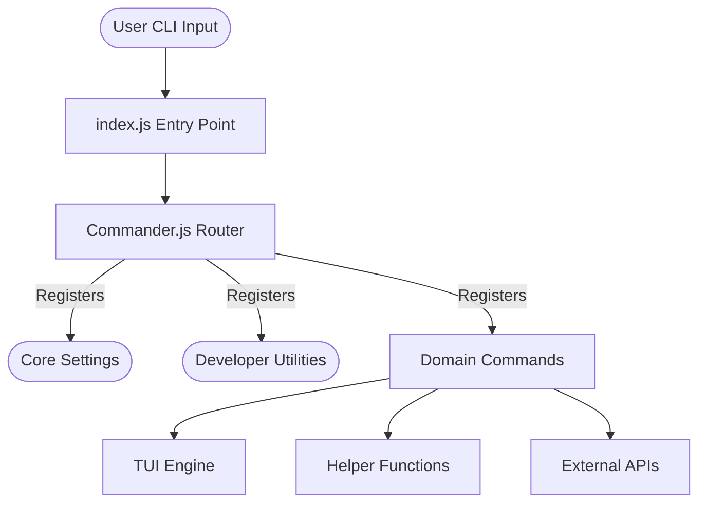

<h1 align="center">🤖 My CLI (CommandLineInterface)</h1>
<p align="center">
<b>A fully featured Node.js CLI toolkit for modern automation and developer workflows.</b>

<i>Uses Commander, Chalk, Inquirer, Axios, OpenAI, simple-git, and more.</i>
# 🧠 Terminal-Based Developer Toolkit using Node.js

This project implements an **end-to-end command-line interface (CLI) toolkit** to **supercharge developer productivity** using Node.js and modern terminal libraries.

The goal is to provide a single interface for **system monitoring, productivity tracking, API testing, and AI-driven assistance**, which is a common and critical task for **software engineers and DevOps professionals**.

---

## 📌 Project Overview

* **Input**: Terminal commands and interactive prompts
* **Output**: Formatted data, TUI dashboards, and system actions
* **Approach**:
  * Build a scalable command architecture using `commander`
  * Add interactive configurations using `inquirer`
  * Integrate system monitoring using `systeminformation`
  * Enable beautiful TUI rendering using `blessed` and `chalk`

This project focuses on **practical CLI engineering**, handling:
* Asynchronous processes
* System-level integrations
* Terminal user interfaces
* Interactive prompts and formatting

---

## 🧪 Core Capabilities

This project offers the **MyCLI (Developer Toolkit)**.

### 🔗 Toolkit installation (REQUIRED)

You **must install the tool globally** to use it efficiently:

👉 **[npm install -g mycli] (Or linking locally)**

After cloning:
1. Extract the files
2. Run `npm install` and `npm link` in the root directory

```text
project-root/
│── commands/
│── utils/
│── tests/
│── index.js
│── package.json
│── README.md
```

⚠️ Environment variables (`GITHUB_TOKEN`, `HF_TOKEN`) are **not included** and must be provided via a `.env` file or CLI config.

---

## 📊 Command Categories

After installation, the CLI contains the following categories:

| Category Name | Description |
| --- | --- |
| `System & Monitoring` | Real-time CPU, RAM, Network, and Disk usage dashboards |
| `Dev Tools` | HTTP client, JSON viewer, Regex tester, Base64 encoder |
| `Productivity` | Pomodoro timer, Notes manager, Todo list, Clipboard |
| `DevOps` | SSH manager, Docker controller, Deployment helpers |
| `AI & Chat` | Explain code and chat with AI (Hugging Face / OpenAI) |
| `Customization` | Multiple themes (Dracula, Monokai) and config options |

---

## 🧠 Key Commands

Common utilities include:

* `monitor` (System Resource TUI)
* `http get/post` (API Tester)
* `focus` (Pomodoro Timer)
* `notes` (Markdown Manager)
* `docker` (Container CLI)
* `ai ask` (AI Coding Assistant)
* `clipboard` (Copy/Paste Utils)
* `regex` (Pattern Matcher)
* `ticker` (Crypto/Stock Prices)

Each command corresponds to **real daily productivity needs** such as checking disk space, generating secure passwords, deploying sites, or extracting JSON.

---

## 🏗️ Architecture & High-Level Design

The CLI uses a **modular command architecture** designed for extensibility:

* `commander` for routing (e.g., `mycli <command>`)
* Shared utility layer (`tui-engine.js`, `helpers.js`)
* Command modules segregated by domain (e.g., `commands/network.js`)
* Configurable styling using `chalk` and themes



This architecture is lightweight, extensible, and well-suited for **rapid feature addition**.

---

## 🛡️ Enterprise Features

* **Strict CI/CD Pipelines:** Automated matrix testing across Node 18, 20, and 22 via GitHub Actions.
* **Security Auditing:** Zero-day package checks run automatically on every push via `npm audit`.
* **Global Error Handling:** Application degradation is handled gracefully using `uncaughtException` intercepts—say goodbye to messy stack traces for end users.
* **Component Segregation:** Logic separation into discrete modules makes the system inherently scalable.

---

## ⚙️ Requirements

### 🐍 Node.js

* **Node.js 18.x or higher (mandatory)**
  > Newer versions with native fetch/test runner support are recommended.

### 📦 Node Dependencies

Core dependencies include:
```txt
commander>=11.0.0
chalk>=5.0.0
inquirer>=9.0.0
axios>=1.0.0
blessed>=0.1.8
blessed-contrib>=4.114.2
```

Install all dependencies:
```bash
npm install
```

---

## 🛠️ Environment Setup

### 1️⃣ Clone and setup

```bash
git clone https://github.com/Adarsh16-30/CommandLineInterface.git
cd CommandLineInterface
npm install
```

### 2️⃣ Verify Node version

```bash
node --version
```

Expected:
```text
v18.x.x or higher
```

---

## ▶️ How to Run

Once installed and dependencies are ready:

```bash
npx mycli help-all
```

The script will:
* Load all 40+ commands
* Display the organized help menu
* Let you select and run interactive commands like `mycli monitor` or `mycli demo`

---

## 📈 Output Artifacts

After running various commands, you will get:

* `.mycli-config.json` → user configuration profile
* `.mycli-notes/` → stored markdown notes
* Terminal dashboards (TUI rendering)
* Console metrics (Network speeds, CPU usage, etc.)

---

## 🧠 Why CLI Tools?

Developer tasks are **text-based workflows** (deployments, file generation, API calls).
CLIs naturally provide:
* Speed and automation
* Keyboard-only efficiency
* Low resource overhead

This makes them the **industry-standard choice** for modern developer experience (DX).

---

## 🎯 Project Highlights (Resume-Ready)

* Built an end-to-end Node.js CLI toolkit for developer workflows
* Handled real-world system integrations (processes, network, disk)
* Designed interactive Text User Interfaces (TUIs) using blessed-contrib
* Implemented modular command architecture and plugin readiness
* Focused on practical productivity rather than simple shell scripts

---

## 🚀 Possible Extensions

* Global cloud syncing for configuration and notes
* Multi-AI provider support (Anthropic, Gemini)
* Rich interactive shell mode (REPL)
* Cross-platform package publishing (Homebrew, APT)

---

## 📜 License & Notice

* Code: Open for educational and research use (MIT License)

---

### ✅ Final Note

This project is designed to reflect **real modular JavaScript/Node architectures**, not just basic scripts.
If you can build and extend this end-to-end, you’ve already mastered many patterns that appear in real industry CLI apps.
