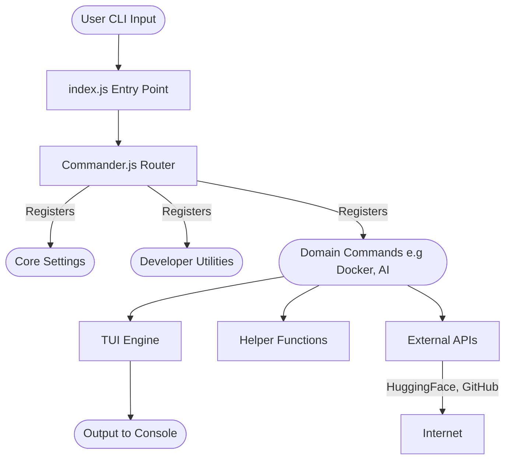

# MyCLI Architecture & High-Level Design

This document outlines the internal architecture of the MyCLI project. The goal of this architecture is to provide a highly cohesive, loosely coupled environment where new commands and utilities can be added seamlessly.

## High-Level Design (HLD)

## Core Components

### 1. `index.js` (The Entry Point & Registry)
* Initializes `Commander` and handles global error catching for enterprise reliability.
* Dynamically registers command modules, mapping them to the central `program` instance.

### 2. Command Modules (`commands/*.js`)
* Each domain or tool resides in its own discrete file (`network.js`, `ai.js`).
* Modules are strictly typed to act recursively on parsed terminal arguments, passing tasks to utilities.

### 3. Utility Services (`utils/`)
* **TUI Engine**: Encapsulates `blessed` and `blessed-contrib` to render rich terminal interfaces without cluttering business logic.
* **Helpers**: Cross-cutting concerns such as update notifications, API fetching, and generic formatting.
* **Colors / Theming**: Standardized theme loading ensuring visual consistency across all components.

## Enterprise Principles Followed

1. **Separation of Concerns**: UI rendering (TUI) is separated from business computation and network calls.
2. **Fail-Gracefully Global Handlers**: Uncaught exceptions are intercepted explicitly to warn end-users rather than throwing cryptic stack traces.
3. **Automated Security**: Fully CI-integrated vulnerability scanning via `npm audit` inside automated GitHub Actions matrices.
